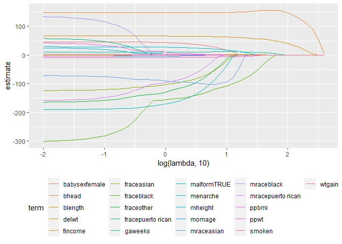
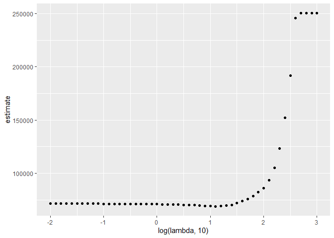
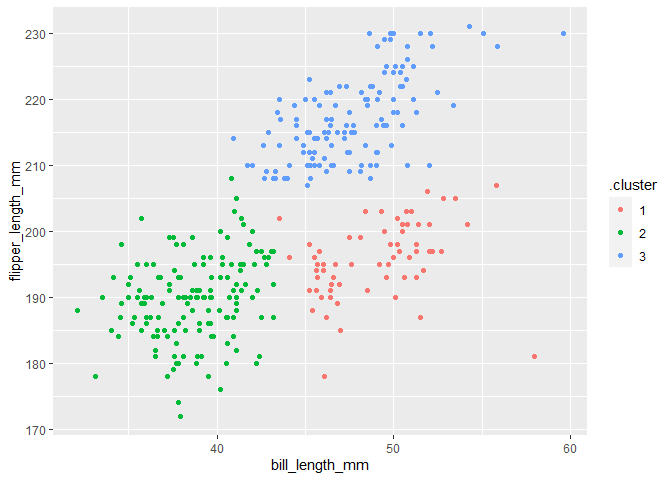

statistical learning
================

``` r
library(tidyverse)
```

    ## ── Attaching core tidyverse packages ──────────────────────── tidyverse 2.0.0 ──
    ## ✔ dplyr     1.1.3     ✔ readr     2.1.4
    ## ✔ forcats   1.0.0     ✔ stringr   1.5.0
    ## ✔ ggplot2   3.4.3     ✔ tibble    3.2.1
    ## ✔ lubridate 1.9.2     ✔ tidyr     1.3.0
    ## ✔ purrr     1.0.2     
    ## ── Conflicts ────────────────────────────────────────── tidyverse_conflicts() ──
    ## ✖ dplyr::filter() masks stats::filter()
    ## ✖ dplyr::lag()    masks stats::lag()
    ## ℹ Use the conflicted package (<http://conflicted.r-lib.org/>) to force all conflicts to become errors

``` r
library(glmnet)
```

    ## Loading required package: Matrix
    ## 
    ## Attaching package: 'Matrix'
    ## 
    ## The following objects are masked from 'package:tidyr':
    ## 
    ##     expand, pack, unpack
    ## 
    ## Loaded glmnet 4.1-8

``` r
set.seed(1)
```

## LASSO

``` r
bwt_df = 
  read_csv("data/birthweight.csv") |> 
  janitor::clean_names() |>
  mutate(
    babysex = as.factor(babysex),
    babysex = fct_recode(babysex, "male" = "1", "female" = "2"),
    frace = as.factor(frace),
    frace = fct_recode(
      frace, "white" = "1", "black" = "2", "asian" = "3", 
      "puerto rican" = "4", "other" = "8"),
    malform = as.logical(malform),
    mrace = as.factor(mrace),
    mrace = fct_recode(
      mrace, "white" = "1", "black" = "2", "asian" = "3", 
      "puerto rican" = "4")) |> 
  sample_n(200)
```

    ## Rows: 4342 Columns: 20
    ## ── Column specification ────────────────────────────────────────────────────────
    ## Delimiter: ","
    ## dbl (20): babysex, bhead, blength, bwt, delwt, fincome, frace, gaweeks, malf...
    ## 
    ## ℹ Use `spec()` to retrieve the full column specification for this data.
    ## ℹ Specify the column types or set `show_col_types = FALSE` to quiet this message.

get predictions and outcome.

``` r
x = model.matrix(bwt ~ ., bwt_df)[, -1]
y = bwt_df |> pull(bwt) # outcome
```

``` r
lambda = 10^(seq(3, -2, -0.1)) # 50 lambda values, from 10^3 to 10^-2

lasso_fit = 
  glmnet(x, y, lambda = lambda)

lasso_cv = # cross validation
  cv.glmnet(x, y, lambda = lambda)

lambda_opt = lasso_cv$lambda.min
```

let’s look at lasso results!

``` r
lasso_fit |>
  broom::tidy() |>
  filter(step == 15) # at step 15, what predictors are in the model?
```

    ## # A tibble: 7 × 5
    ##   term         step  estimate lambda dev.ratio
    ##   <chr>       <dbl>     <dbl>  <dbl>     <dbl>
    ## 1 (Intercept)    15 -5298.      39.8     0.722
    ## 2 bhead          15   156.      39.8     0.722
    ## 3 blength        15    55.7     39.8     0.722
    ## 4 delwt          15     0.696   39.8     0.722
    ## 5 fraceblack     15   -32.5     39.8     0.722
    ## 6 gaweeks        15     8.19    39.8     0.722
    ## 7 smoken         15    -0.297   39.8     0.722

``` r
lasso_fit |>
  broom::tidy() |>
  select(term, lambda, estimate) |>
  filter(term != "(Intercept)") |>
  complete(term, lambda, fill = list(estimate = 0)) |>
  ggplot(aes(x = log(lambda, 10), y = estimate, color = term, group = term)) +
  geom_path() +
  theme(legend.position = "bottom")
```

<!-- -->

Show the CV results.

``` r
lasso_cv |>
  broom::tidy() |>
  ggplot(aes(x = log(lambda, 10), y = estimate)) +
  geom_point()
```

<!-- -->

## Penguins

``` r
library(palmerpenguins)

data("penguins")

penguins = 
  penguins |> 
  select(species, bill_length_mm, flipper_length_mm) |> 
  drop_na()

penguins |>
  ggplot(aes(x = bill_length_mm, y = flipper_length_mm, color = species)) +
  geom_point()
```

<!-- -->

``` r
kmeans_fit = 
  penguins |>
  select(-species) |>
  scale() |> # rescale the remaining columns
  kmeans(centers = 3)

penguins |>
  broom::augment(kmeans_fit, data = _) |>
  ggplot(aes(x = bill_length_mm, y = flipper_length_mm, color = .cluster)) +
  geom_point()
```

<!-- -->
